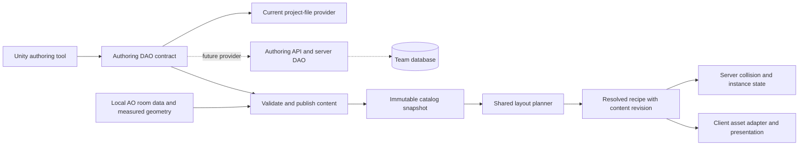

# Dungeon authoring data and DAO boundaries

October 4, 2026. The user requested data-driven room capabilities and a DAO-oriented
storage design. Room assignments must remain editable content, rather than C#
conditions on particular room numbers or file names.

## Current implementation

`NativeRoomAnnotation` contains multiple allowed uses (arena, encounter, connector,
hub), a separate landmark flag, reviewed state, theme tags, notes and an optional
encounter-center coordinate/region. `NativeRoomOverride` associates this with the
source room ID alongside enabled state, socket exclusions and lighting settings.
The parent `NativeRoomOverrides` identifies the source playfield/resource revision
and carries an optimistic authoring revision. No role is assigned automatically
from a PF 127 room name or index.

The preparation tool's source/entrance/spawn and pool assignments now live in
`tools/WorldGen.NativeRoomCatalog/pf127.source.json`, including the captured doorway
check cases. `NativeRoomSourceDefinition` validates this editable package data;
the existing assignments are preserved. A fifth preparation argument can select
another source definition. The generator and native editor derive available pool
names from the catalog rather than a hardcoded mall/depths list.

The Unity native authoring window reads/saves through `INativeRoomAuthoringDao`.
The current provider is `NativeRoomAuthoringFileDao`, storing the existing project
file `tools/WorldGen.NativeRoomCatalog/pf127.authoring.json`. This is an actual
file-backed DAO, not a SQL database implementation. It is the local provider while
the permanent storage choice is decided. No server database schema is changed.

Writes validate the aggregate, compare its loaded revision with storage, take a
cooperating-process file lock, flush a temporary file and atomically replace the
old file. A stale writer gets an explicit conflict. The host supplies serialization,
so the shared interface/provider has no Unity or SQL dependency. Source definition
identity and catalog application prevent attaching settings to a changed source
without review. Marker validation requires a measured, accessible walking sample.
Hub/connector doorway counts are authoring warnings, not arbitrary hard failures.
Arena suitability still requires visual review; point support alone does not
prove an entire arena or future NPC navmesh is suitable.

Capability values are stable identifiers understood by the planner. The engine
must contain rules for what a connector or hub means; which rooms qualify, themes,
exclusions and marker locations belong to authored data. Room-template capability
must also remain distinct from a particular placed room's assigned encounter role.
The latter belongs to a resolved run plan, which is not implemented yet.

## Recommended permanent storage

For a shared team authoring catalog, use the existing server-side database and DAO
patterns, with an authenticated authoring API between Unity and those DAOs. Unity
must not contain server database credentials. A local SQLite provider is useful
when authors need a self-contained offline database; neither provider should be
embedded in the generation algorithm.

These storage options can share the aggregate contract and publication workflow.
The current file provider also supports Git review of metadata. Do not maintain
an independently editable JSON catalog and SQL catalog as competing authorities:
choose one authoring authority, and treat published JSON as an export/build artifact
when a database becomes authoritative.

Suggested logical records for the SQL provider:

| Record | Data and responsibility |
| --- | --- |
| Asset source/revision | Provider key, source playfield, definition/collision fingerprints and source-room identity |
| Source package settings | Entrance reference, supported spawn offset, room-pool assignments and source-specific validation cases |
| Room template | Stable source-room reference, enabled/reviewed state, landmark flag, notes and edit revision |
| Room allowed use | Many-to-many room/capability assignments; a room may support several uses |
| Room theme | Many-to-many theme tags; general themes can be shared across asset sources |
| Room socket settings | Stable source socket reference, exclusions and closure appearance |
| Room encounter anchor | Room-local supported point, walking region and future clearance requirements |
| Room lighting settings | Authored intensity/range/emission adjustments |
| Dungeon profile | Authored pacing constraints, boss-stage requirements, permitted themes/sources and repetition limits |
| Published catalog | Immutable validated content revision/hash; derived geometry and authored metadata combined |
| Resolved dungeon recipe | Seed, profile/catalog revision, placed room references, transforms, joins and future assigned encounter roles |

The logical tables above are a design proposal, not a migration or deployed schema.
The existing native overrides DAO exposes a per-source aggregate; a SQL/API provider
can hydrate that aggregate from normalized rows and save it in one transaction.
Use a compare-and-swap edit revision, source/room/socket foreign keys and unique
role/theme assignments. Database writes must not bypass the same catalog/marker
validation used by the editor and publisher.

Use transactional tables and group related edits into one transaction, following
[MySQL's InnoDB transaction guidance](https://dev.mysql.com/doc/refman/8.4/en/innodb-best-practices.html).

## Publication and runtime

The gameplay planner consumes a validated catalog snapshot rather than querying
mutable rows for each selected room. This preserves determinism and keeps a seed
and its saved recipe tied to a content revision. It also avoids database calls in
generation loops and lets authoring change without altering active runs. Derived
geometry belongs to preparation/publishing, not manually maintained SQL columns
that can drift from the source mesh.

The proprietary AO installation/database remains a separate, read-only source of
meshes and textures. Our metadata database would contain references and settings,
not redistributed copies of those assets. Local source revisions must agree with
the published catalog used by the server/client.

## Next implementation stages

1. Use the new native UI to review and tag room capabilities and supported centers.
2. Select the permanent team store and implement its DAO/API provider. Add a
   reviewed migration only when that database change is explicitly selected.
3. Add publication/export against the same validators, preserving content revisions
   and an auditable authoring-to-runtime relationship.
4. Implement the additional dungeon-run profile from authored profile data. Keep
   normal generation available and avoid hardcoded room-role mappings.
5. Extend source references/adapters to other native playfields and authored GLB
   rooms. Their shared capability model does not erase geometric join differences.

The current tags are saved authoring data; gameplay changes only when settings are
published into a matching client/server catalog. Normal generation currently
ignores capability tags. XP, loot and encounter state are outside this change.

## Verification

Runtime/editor compilation and local server publication/startup validation passed.
Focused authoring checks cover role/theme/marker validation, source identity,
DAO round trips, optimistic save conflicts and unchanged normal layouts; a custom
pool name confirms the pool list comes from data. The preparation tool's 336
seed/count/pool cases and authored raised-doorway checks pass. Comparing its output
to the active catalog confirms all prior measured values are identical apart from
the new optional annotation field; collision bytes are identical.

The original published client/server catalog is retained at SHA-256
`99ab46806f56e373db98103b6b1355b8b62451d611d657e67edf2a7f4fd98328`.
A preparation check wrote only `/tmp/pf127-native-annotations-prepared`; its JSON
hash is `e916f58d85548ca37d3772febab8df7ff30e65fd24a319d177cef34f1ee39618`.
This additive-schema output was not substituted into gameplay, preserving current
saved content references. The Unity editor/game client was not launched, and the
running server was not changed. UI tagging/picking and the original-client copy
remain user acceptance checks.
