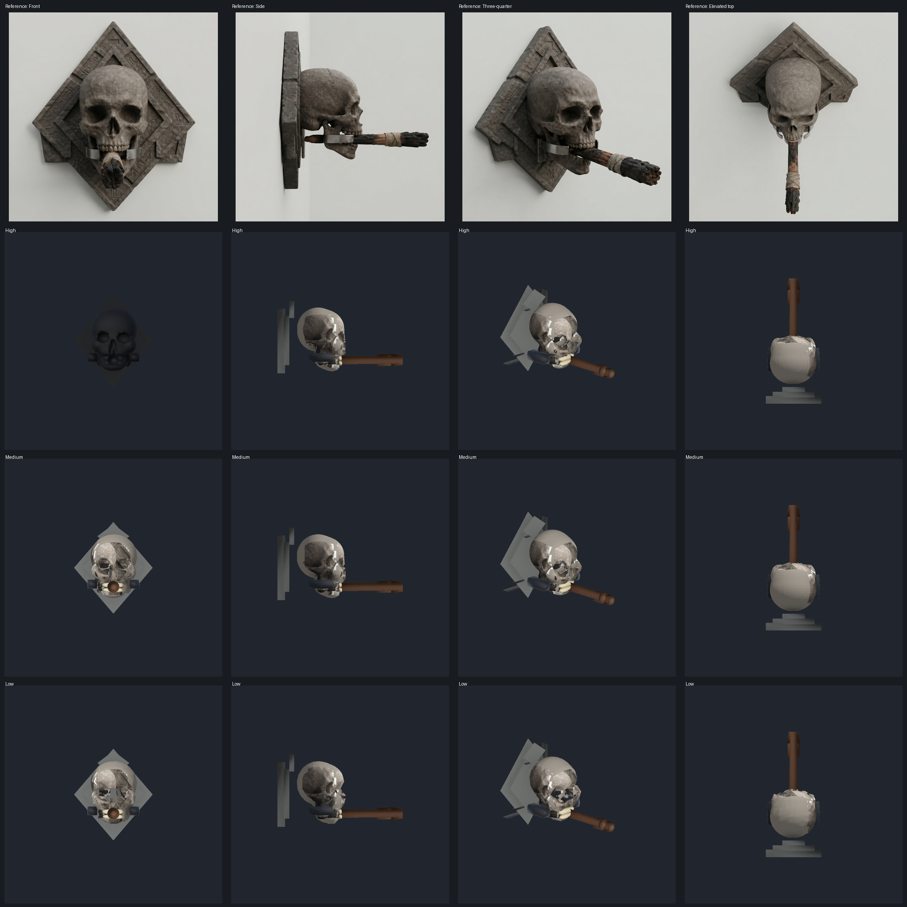

# Skull-torch a07 Unity review — rejected

Unity 6000.6.0f1 imported the review LOD JSON into
`Assets/Generated/WorldGenReview/TempleSkullTorchA07.prefab` and captured twelve fixed views:
high, medium, and low from front, side, three-quarter, and top. The Unity batch run completed.
The high/medium/low files contain **31,999 / 11,248 / 2,632 triangles**. Production LOD0 was
not changed.

## Findings

- The CPU projection now matches Unity's screen-right convention: the front camera is at +Z and
  the side camera is at +X. With that correction, whole-object IoU is **0.611 front, 0.710 side,
  0.714 three-quarter, 0.696 elevated top**. Coverage is **0.615 / 0.769 / 0.745 / 0.759**.
  Every view fails the 0.80 IoU and 0.90 coverage gates.
- The fitted a06 skull region scores **0.907 front / 0.868 side**. Its rounded rear cranium,
  orbital rims, jaw, teeth, and attachment still miss the photos.
- Named SDF cavity anchors were compared with their photo feature masks. After mapping the
  reference's image-left/right orbital names to the correct object-space primitives, all six
  tested anchor projections land inside their masks. The orbital centers are within 0.4 and
  2.0 grid pixels in front; the temporal opening is 3.3 pixels from its side-mask center.
  Center alignment alone does not establish the right cavity shape or depth.
- The calibrated coarse hull fills the eye and nose openings; the correctly calibrated a02 hull
  is rejected.
- Six-chart UVs, smooth normals, photo color projection, LOD export, and Unity prefab import
  run end to end. The atlas still picks up plaque and torch pixels, misplaces facial color, and
  leaves unseen charts inferred. Medium and low visibly alter facial detail and material.
- The current silhouette-only LOD continuity check does not catch these appearance changes.
  No tangent-space normal-map transfer or in-scene frame-cost measurement has been completed.

## Next acceptance work

Mark precise skull-only feature contours and cavities in each photo. Fit camera pose and a smooth
skull surface jointly while preserving cavities and attachments. Reproject only verified skull pixels,
then transfer high-mesh detail to lower LOD normal maps. Add appearance checks to LOD export and
measure switching and frame cost in a test scene before promoting any asset.
